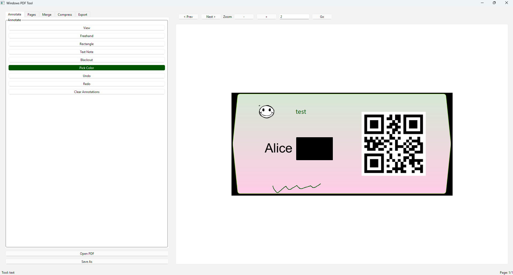

# Windows PDF Tool

Windows desktop PDF utility built with Python and PySide6.

## Features

- Open and view PDF files
- Draw freehand, rectangle, text notes, and blackout overlays
- Undo/redo annotations before saving
- Delete one or more pages
- Merge multiple PDFs
- Compress PDF with custom DPI/quality and optional grayscale
- Export PDF pages to PNG/JPG images

## Layout

## User Manual

See `USER_MANUAL.md` for complete usage instructions.

## Setup

```powershell
python -m venv .venv
.venv\Scripts\Activate.ps1
pip install -r requirements.txt
```

## Run

```powershell
python src/main.py
```

## Build EXE (PyInstaller)

```powershell
pyinstaller build.spec
```

The generated executable will be in `dist/WindowsPDFTool/`.
